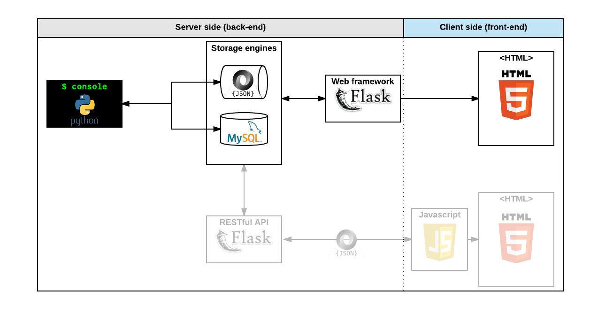

# AirBnB_clone


Welcome to the AirBnB clone project! A project that allows me to practice frontend and backend. The AirBnB clone is a series of project that has four parts. The goals of the project is to deploy on your own server a simple copy of the [AirBnB Website](https://airbnb.com).

**Project duration**: 4 Months

## Parts of the project

- A command interpreter to manipulate data without a visual interface, like in a Shell (perfect for development and debugging)
- A website (the front-end) that shows the final product to everybody: static and dynamic
- A database or files that store data (data = objects)
- An API that provides a communication interface between the front-end and your data (retrieve, create, delete, update them)

## Final Product


## Concepts to learn

- Unit testing in Python
- Python packages
- Serialization / Deserialization
- `*args, **kwargs`
- `datetime`

## Steps

This project will be following a step by step approach. This means we will break down the project into four parts as seen above.

### The console

- Create your data model.
- Manage(create, update, destroy, etc) objects via console / command interpreter
- Store and persist objects to a file (JSON file)

The first piece is to manipulate a powerful storage system. This storage engine will give us an abstraction between “My object” and “How they are stored and persisted”. This means: from your console code (the command interpreter itself) and from the front-end and RestAPI you will build later, you won’t have to pay attention (take care) of how your objects are stored.

This abstraction will also allow you to change the type of storage easily without updating all of your codebase.

The console will be a tool to validate this storage engine.


### Web static

- learn HTML/CSS
- create the HTML of your application
- create template of each object


### MySQL storage

- replace the file storage by a Database storage
- map your models to a table in database by using an O.R.M.


### Web framework - templating

- create your first web server in Python
- make your static HTML file dynamic by using objects stored in a file or database



### RESTful API

- expose all your objects stored via a JSON web interface
- manipulate your objects via a RESTful API


### Web dynamic

learn JQuery
load objects from the client side by using your own RESTful API


## Files and Directories

- `models` directory will contain all classes used for the entire project. A class, called “model” in a OOP project is the representation of an object/instance.
- `tests` directory will contain all unit tests.
- `console.py` file is the entry point of our command interpreter.
- `models/base_model.py` file is the base class of all our models. It contains common elements:
	- attributes: `id`, `created_at` and `updated_at`
	- methods: `save()` and `to_json()`
- `models/engine` directory will contain all storage classes (using the same prototype). For the moment you will have only one: `file_storage.py`.

## Storage

Persistency is really important for a web application. It means: every time your program is executed, it starts with all objects previously created from another execution. Without persistency, all the work done in a previous execution won’t be saved and will be gone.

In this project, you will manipulate 2 types of storage: file and database. For the moment, you will focus on file.

Why separate “storage management” from “model”? It’s to make your models modular and independent. With this architecture, you can easily replace your storage system without re-coding everything everywhere.

You will always use class attributes for any object. Why not instance attributes? For 3 reasons:

- Provide easy class description: everybody will be able to see quickly what a model should contain (which attributes, etc…)
- Provide default value of any attribute
- In the future, provide the same model behavior for file storage or database storage

## How I can store my instances?

That’s a good question. So let’s take a look at this code:

```python
class Student():
    def __init__(self, name):
        self.name = name

students = []
s = Student("John")
students.append(s)
```

Here I am creating a sudent and storing it in a list. But after this program execution, my Student instance doesn’t exist anymore.

```python
class Student():
    def __init__(self, name):
        self.name = name

students = reload() # recreate the list of Student objects from a file
s = Student("John")
students.append(s)
save(students) # save all Student objects to a file
```

Nice!

But how it works?

First, let’s look at `save(students)`:

  - Can I write each `Student` object to a file => NO, it will be the memory representation of the object. For another program execution, this memory representation can’t be reloaded.
- Can I write each `Student.name` to a file => YES, but imagine you have other attributes to describe `Student`? It would start to be become too complex.
The best solution is to convert this list of `Student` objects to a JSON representation.

Why JSON? Because it’s a standard representation of object. It allows us to share this data with other developers, be human readable, but mainly to be understood by another language/program.

Example:

- My Python program creates `Student` objects and saves them to a JSON file
- Another Javascript program can read this JSON file and manipulate its own `Student` class/representation
And the `reload()`? now you know the file is a JSON file representing all `Student` objects. So `reload()` has to read the file, parse the JSON string, and re-create `Student` objects based on this data-structure.

## File storage == JSON serialization

For this first step, you have to write in a file all your objects/instances created/updated in your command interpreter and restore them when you start it. You can’t store and restore a Python instance of a class as “Bytes”, the only way is to convert it to a serializable data structure:

- convert an instance to Python built in serializable data structure (list, dict, number and string) - for us it will be the method `my_instance.to_json()` to retrieve a dictionary
- convert this data structure to a string (JSON format, but it can be YAML, XML, CSV…) - for us it will be a `my_string = JSON.dumps(my_dict)`
- write this string to a file on disk

And the process of deserialization?

The same but in the other way:

- read a string from a file on disk
- convert this string to a data structure. This string is a JSON representation, so it’s easy to convert - for us it will be a `my_dict = JSON.loads(my_string)`
- convert this data structure to instance - for us it will be a `my_instance = MyObject(my_dict)`

## *args, **kwargs

How do you pass arguments to a function?
```python
def my_fct(param_1, param_2):
    ...

my_fct("Best", "School")
```
But with this function definition, you must call `my_fct` with 2 parameters, no more, no less.

Can it be dynamic? Yes you can:
```python
def my_fct(*args, **kwargs):
    ...

my_fct("Best", "School")
```
What? What’s *args and **kwargs?

- *args is a Tuple that contains all arguments
- *kwargs is a dictionary that contains all arguments by key/value
A dictionary? But why?

So, to make it clear, *args is the list of anonymous arguments, no name, just an order. **kwargs is the dictionary with all named arguments.

Examples:
```python
def my_fct(*args, **kwargs):
    print("{} - {}".format(args, kwargs))

my_fct() # () - {}
my_fct("Best") # ('Best',) - {}
my_fct("Best", 89) # ('Best', 89) - {}
my_fct(name="Best") # () - {'name': 'Best'}
my_fct(name="Best", number=89) # () - {'name': 'Best', 'number': 89}
my_fct("School", 12, name="Best", number=89) # ('School', 12) - {'name': 'Best', 'number': 89}
```
Perfect? Of course you can mix both, but the order should be first all anonymous arguments, and after named arguments.

Last example:
```python
def my_fct(*args, **kwargs):
    print("{} - {}".format(args, kwargs))

a_dict = { 'name': "Best", 'age': 89 }

my_fct(a_dict) # ({'age': 89, 'name': 'Best'},) - {}
my_fct(*a_dict) # ('age', 'name') - {}
my_fct(**a_dict) # () - {'age': 89, 'name': 'Best'}
```
You can play with these 2 arguments to clearly understand where and how your variables are stored.

## `datetime`

`datetime` is a Python module to manipulate date, time etc…

In this example, you create an instance of `datetime` with the current date and time:
```python
from datetime import datetime

date_now = datetime.now()
print(type(date_now)) # <class 'datetime.datetime'>
print(date_now) # 2017-06-08 20:42:42.170922
```
`date_now` is an object, so you can manipulate it:
```python
from datetime import timedelta

date_tomorrow = date_now + timedelta(days=1)
print(date_tomorrow) # 2017-06-09 20:42:42.170922
```
… you can also store it:
```python
a_dict = { 'my_date': date_now }
print(type(a_dict['my_date'])) # <class 'datetime.datetime'>
print(a_dict) # {'my_date': datetime.datetime(2017, 6, 8, 20, 42, 42, 170922)}
```
What? What’s this format when a `datetime` instance is in a datastructure??? It’s unreadable.

How to make it readable: strftime
```python
print(date_now.strftime("%A")) # Thursday
print(date_now.strftime("%A %d %B %Y at %H:%M:%S")) # Thursday 08 June 2017 at 20:42:42
```

** Data Diagram


## Development Process

This project will also allow me to demonstrate the Software Development Life Cycle(SDLC). The Software Development Life cycle is as follows:

- Planning
- Analysis (Checking Requirements)
- Design
- Implementation stage (Building according to project requirements)
- Testing
- Maintenance

